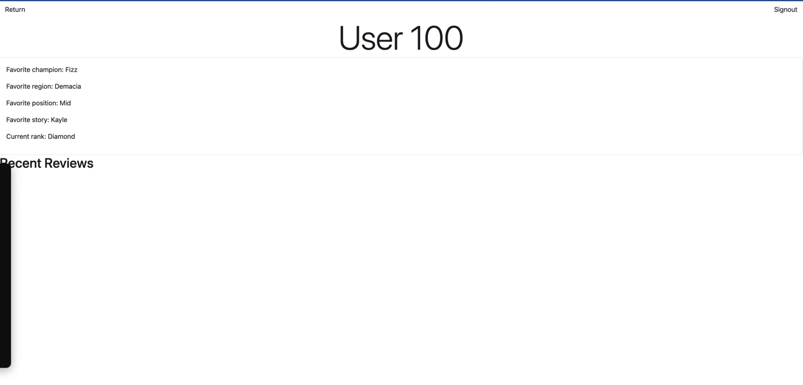
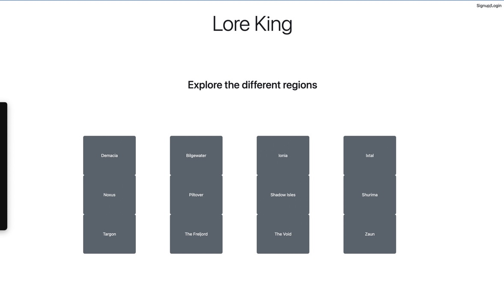
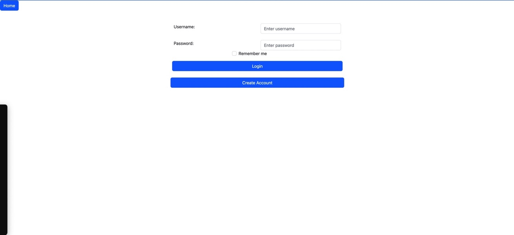
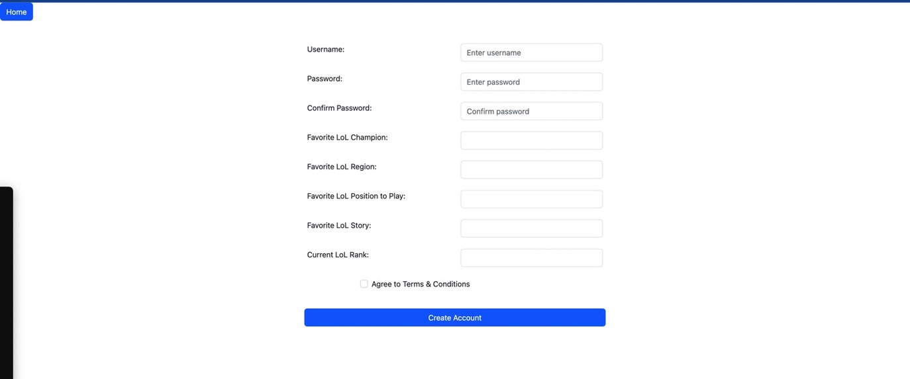
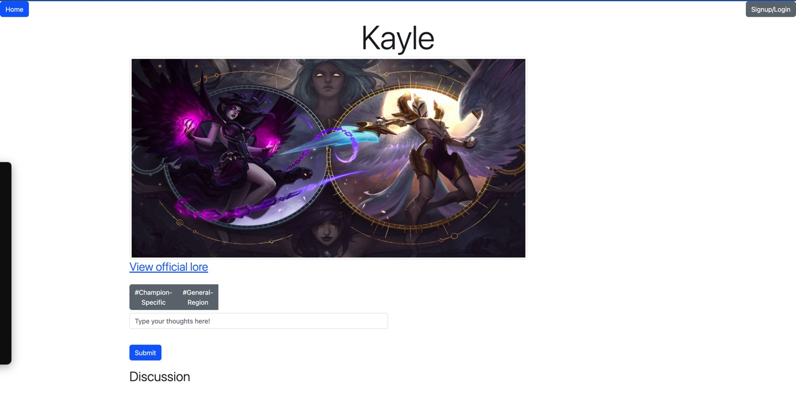
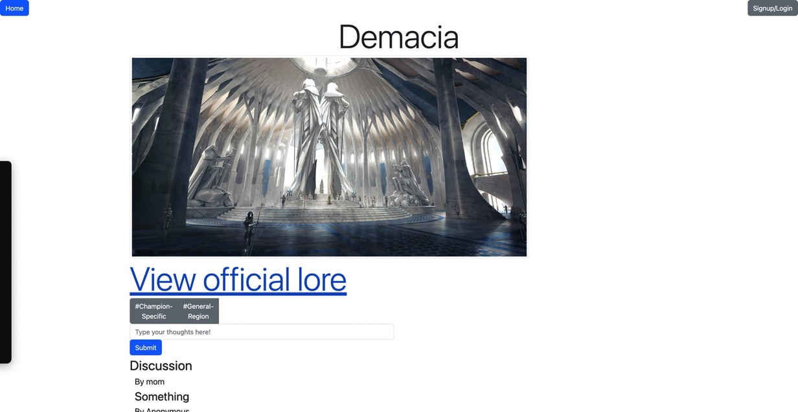

# Team Gamma
# Lore King

### Semester: Fall 2022

## Overview

Our site allows users to explore League of Legends lore, and make comments on each individual lore page in a discussion section.

Members: Joshua Hernandez, Stephen Cassata, Will Mackin

## UI

##### Account Page

</img>

- Return Button - goes to home page
- Signout button - signs out user

##### Home page

</img>

- Signup/login button - goes to login page, becomes account button if signed in
- Clickable regions (Demacia - Zaun) - goes to region page for region clicked on

##### Login Page

</img>

- Username text box - username for login
- Password textbox - password for login
- Remember me checkbox - not functional, would keep user signed in between sessions
- Login button - attempt to log in with given credentials
- Create account button - go to create-an-account-page
- Home button - goes to home page

##### Create-an-account page

</img>

- Text boxes from Username to Current LoL Rank - account information
- Agree to terms and conditions checkbox - doesn't actually matter
- Create account button - creates account and takes user to login page
- Home button - goes to home page

##### Champion Page

</img>

- View official lore link - link to official lore page from LoL website
- Champion-Specific dropdown - dropdown to see list of champion links for that region
- General-Region dropdown - dropdown to see list of region links
- Home button - goes to home page
- Signup/login button - goes to login page, becomes account button if signed in
- Textbox - review goes here
- Submit button - post review in textbox

##### Region Page

</img>

- View official lore link - link to official lore page from LoL website
- Champion-Specific dropdown - dropdown to see list of champion links for that region
- General-Region dropdown - dropdown to see list of region links
- Home button - goes to home page
- Signup/login button - goes to login page, becomes account button if signed in
- Textbox - review goes here
- Submit button - post review in textbox

## Routes

##### Gets

- /login - Redirects to login page
- /logout - Log out user and redirect accordingly
- /signup - Redirects to account creation page
- /user/:userID - Account page, appears by default once signed in, protected by authentication
- /champion.js - sends champion.js file
- /main.js - sends main.js file
- /getRegions - gets regions JSON from stored file
- /champion - renders champion page specified in URL, 404 error if champion not given or does not exist
- /champion - renders region page specified in URL, 404 error if region not given or does not exist
- /signedInUser - gets name of signed in user if one exists

#### Posts

- /login - attempts to log in user
- /signup - Create account and redirect accordingly
- /addPost - Adds user’s review to database

Authentication note: home page, review page, and champion page all have the signup/login button replaced by an account button if the current session is authenticated.

## Database Schema

#### Reviews

- Username - VARCHAR, user who made review
- Lore - VARCHAR, page review was made on
- Review - VARCHAR, text of review, written by user
- Likes - INT, ended up being unused
- Time_posted - TIMESTAMP, time review was posted, used to sort reviews on pages with most recent first

#### Users (all columns are VARCHAR)

- Username - PRIMARY KEY, username
- Password - encrypted version of password
- Champion/Region/Position/Story - all these columns are inputted by the user upon account creation, and are all the user’s favorite X where X is the column name
- Rank - user’s LoL rank
- Salt - salt added for password encryption

## Authentication

Authentication is done through the code provided to us. We take a username and a password, we salt and hash it, save the username, salt, and hash in a sql table. And when we want to sign in we check if the provided password with the known salt produces the same hash. We provide a user page that is individual to each user and then we allow the ability to leave a comment under your username in the champions or regions page. 

## Division of labor

#### Joshua Hernandez
- Mostly focused on adding authentication(Implementing the code given and making sure modifications done to it didn't change functionality and that it didn't affect our previous code), inserting reviews, and region pages. Helped implement html from the wireframe.  Helped reorganize some of the code be it refactoring or indentation and similar issues.  
#### Stephen Cassata
- Helped in the idea-brainstorming process, wireframing, designing UI,  and writing some HTML for the pages. Specifically, the champion.html and the region.html. Assisted with problem solving during the backend engineering. Implemented all the data (Sourced from the official League of Legends website) into the JSON files being champion.JSON and region.JSON. 
#### Will Mackin
- Helped with wireframing, designing UI, and writing HTML for pages (mostly login and signup pages). Set up the initial server and implemented several routes. Enabled discussion posts retrieved from Postgres database to appear on site. Enabled retrieval of data to display regions on home page. Implemented site changes once logged in, including account page. Also managed the Heroku parts.

## Conclusion

In our project we wanted to create a space for users to share their thoughts on League of
Legends Lore stories. LoL has comprehensive lore that writers put a lot of effort into so we
wanted to create a space to expand discussion on it. We wanted to create a homepage that
sorted the stories and champions by region. We initially wanted to add in a functionality that
covered how much lore the user has gone through and read but we quickly realized that this
would be hard to implement. We then made it a comprehensive website that you can explore
each LoL story through and share your thoughts with other users.

We were faced with many challenges, specifically authentication and review posting took a
while to accomplish, but the bugs were mostly small issues where we weren’t aware of how to
fix them.
