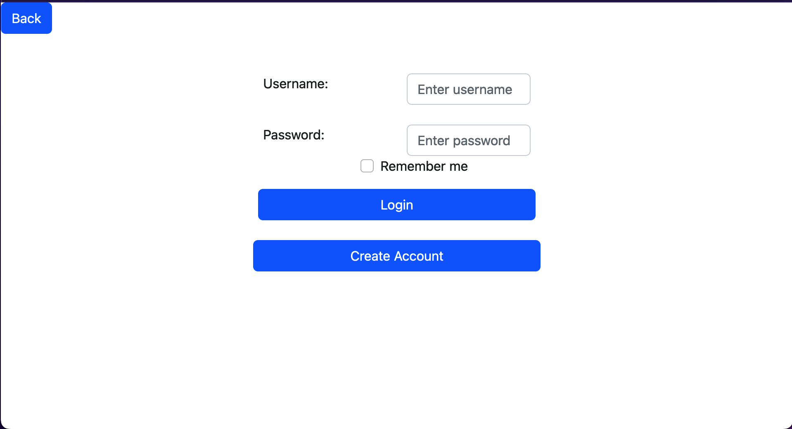
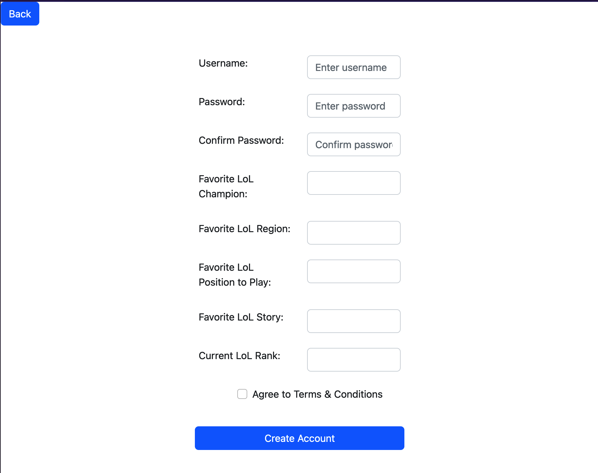

#Part 0 Data Interactions

Users can sign in or create an account with a username and password.

Users will be able to see what percentage of the lore they have looked at, and then view a more detailed list of viewed and unviewed data.

Users can rate and/or write a comment on a piece of lore. Users can also reply to comments.

Users can upload fan fiction under the region or champion it best applies to. It will have its own discussion section.

#Part 1

Here is the page that appears when users click the login button.

Clicking create account from login opens this page where the user sets up there account, and would get redirected to home after creating it.

#Division of Labor

Everyone worked on the wireframe together.

Will did the doc, login, and signup pages.

Steve did the region and champion pages.

Josh did the account and home pages.
