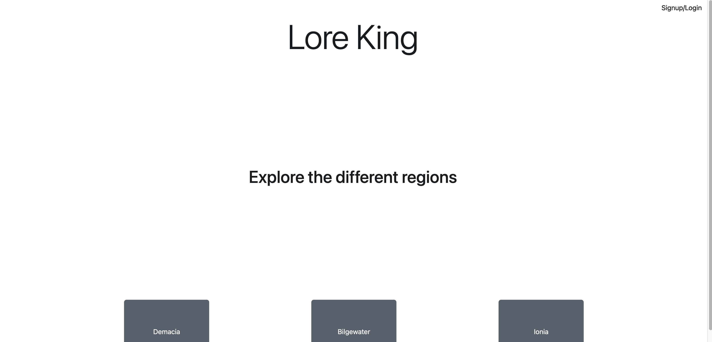
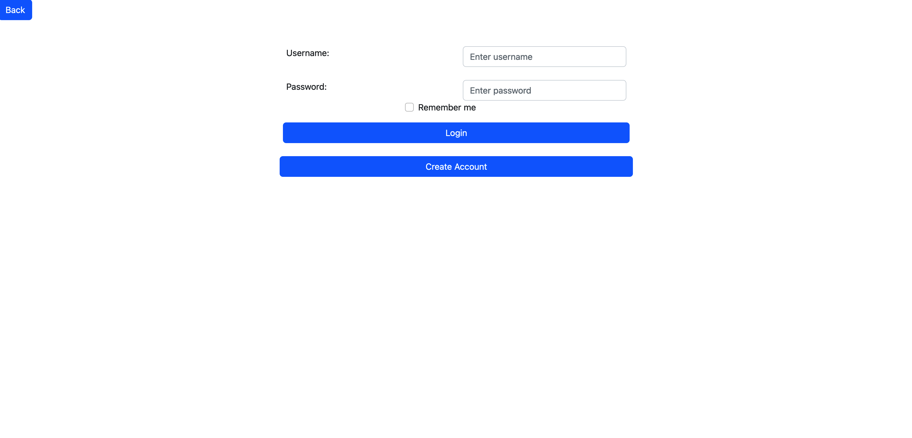
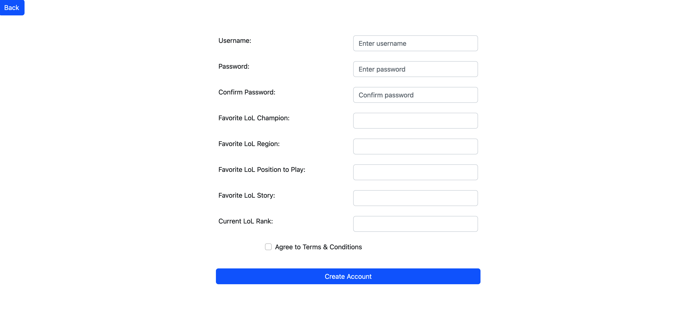

# Part 1

List of endpoints

/login
/signUp
/signOut
/passwordReset
/lore/viewRegions
/lore/viewChampions
/lore/newReview?lore=LORE_HERE&review=TEXT
/lore/newFanfic?lore=LORE_HERE&fanfic=TEXT
/lore/newRating?lore=LORE_HERE&rating=NUMBER
/lore/reviews/view
/lore/ratings/view
/lore/discussionPost
/lore/discussionPost/replies
/user/reviews
/user/ratings
/user/viewedLore
/user/viewLore?lore=LORE_HERE
/user/addReview?lore=LORE_HERE&review=TEXT
/user/addRating?lore=LORE_HERE&rating=NUMBER
/user/addFanfic?lore=LORE_HERE&review=TEXT
/user/roles/
/user/discussionPosted
/user/discussionPost?lore=LORE_HERE&post=TEXT
/user/discussionReply?lore=LORE_HERE&post=ORIGINAL_POST&reply=TEXT

Heroku Link: https://whispering-woodland-38762.herokuapp.com/index.html

# Part 2

Here you can see that clicking login, then signing up and creating an account redirects to index where signup/login is replaced with an account button.

## Division of Labor

The whole team worked on defining the endpoints for part 1 of the doc.
Code done at the time of the submission (mainly making the server and javascript for the home, login and signup pages, with a little bit done on the region page) was done by Will as well as the doc aside from part 1.
Joshua added more javascript after the deadline passed for the region and home pages.
